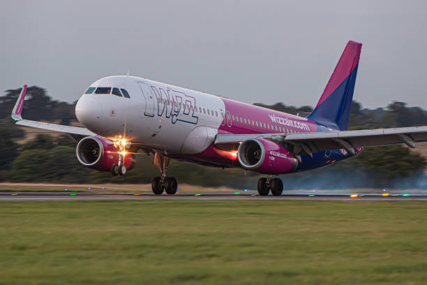

<h1 style="margin: 0">Helló</h1>
<h2 style="margin: 0">My name is Márk</h2>

#  About Me:

I am a Hungarian web developer, living and studying in the United Kingdom. 

Currently taking my placement job at Radweb Ltd. as a junior web developer, contributing to their flagship product called 'InventoryBase'.

I mainly like backend development, working with PHP and Laravel, and MySQL or Postgresql databases. On frontend side, I work with React and TypeScript. Started learning Vue recently so I can ditch React.

# WorldSkills Journey

I represented the UK on international stage in WorldSkills International Lyon 2024 in Web Technologies category, securing the <a href="https://cnwl.ac.uk/about/news-events/article/2024/09/23/student-wins-medallion-for-excellence-at-worldskills-lyon-2024" target="_blank">9th place with a Medallion of Excellence</a> .  
<a href="https://worldskills2024.com/en/home-page/index.html" target="_blank">More about Lyon</a>

I participated in the WorldSkills UK National Finals 2023, where I achieved the first place and the gold medal for web development  
<a href="https://www.cwc.ac.uk/about-us/news-events/article/2023/11/22/student-makes-his-mark-at-worldskills-uk-finals" target="_blank">Read more</a>

# Tech & Tool Stack:

  

# Projects

Please visit my portfolio to learn more about me and my projects (<i>Work in progress</i>) 
<a href="https://markkiss.netlify.app/">Portfolio</a>

Alternatively, you can see my public repos on GitHub 

# GitHub Stats:

 
<!--   -->

# Hobbies

<ul>
    <li> Flight Simulator</li>
    <li>VATSIM Tower Controller</li>
</ul>

## GitHub Trophies

### Top Contributed Repo

### Random Dev Quote

Last Edited on: 27/12/2025
